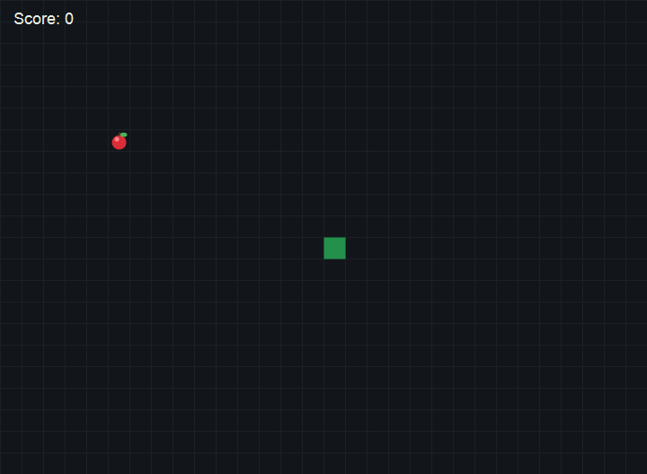

# Snake

A classic grid-based Snake game built with Python and pygame. The player guides the snake around the board, eats apples to grow longer, and tries to survive for as many points as possible.



## How to Run

Install pygame if needed:

```bash
pip install pygame
```

Run the game from this folder:

```bash
python main.py
```

## Controls

- Use the arrow keys or WASD to change direction.
- Press `SPACE` after game over to restart.
- Press `ESC` to quit.

## Rules

- The snake starts in the center of the board and moves automatically.
- Eating an apple increases the score by 1.
- After eating an apple, the snake grows longer.
- A new apple appears in a random empty cell.
- The snake cannot reverse directly into itself.

## Game Over Conditions

The game ends when:

- The snake hits the edge of the board.
- The snake runs into its own body.

When the game ends, the final score is shown on screen.
